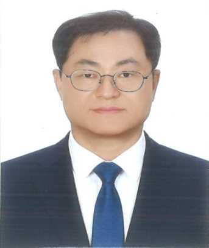

# 박근영 후보자 - 경주시장 선거공보물

**선거명**: 경주시장선거  
**후보자**: 박근영  
**기호**: 1번  
**정당**: 더불어민주당

---

## 📋 5대 공약

1. **경주시민 가정용 전기세 전면 무료** - 약 1,000억 규모
2. **중심상가 문화예술인촌으로 활력충전** - 250억 투자
3. **대릉원-동부사적지구 무차별 거리 확립** - 144억 규모
4. **동국대학교와 함께 가기** - 연간 1,000억 지원
5. **한수원 본사 경주시내 이전** - 국책사업비 활용

---

## 🖼️ 후보자 이미지



---

## 🌐 공식 홍보 페이지

**[박근영 선거공보물 열기](./park_geun_yeong_campaign.html)** ← 클릭하세요

### 페이지 기능
- 📱 모바일 최적화
- 📸 갤러리 탭 (인물, 활동, 전문가 사진)
- 📋 5대 공약 상세 설명
- 👤 약력 정보
- 📰 뉴스 및 소식
- 📞 연락처

---

## 📁 파일 목록

```
elections/park-geun-yeong/
├── park_geun_yeong_campaign.html  (메인 페이지)
├── 얼굴.jpg                       (인물사진)
├── 그냥시민.jpg                   (활동사진)
├── 기호1번.jpg                    (기호사진)
└── README.md                      (이 파일)
```

---

## 📞 선거캠프 정보

**경주시장선거**  
더불어민주당 박근영 후보

---

**지역 토박이, 관광 산업 전문가로 경주 관광산업 발전을 주도합니다**
